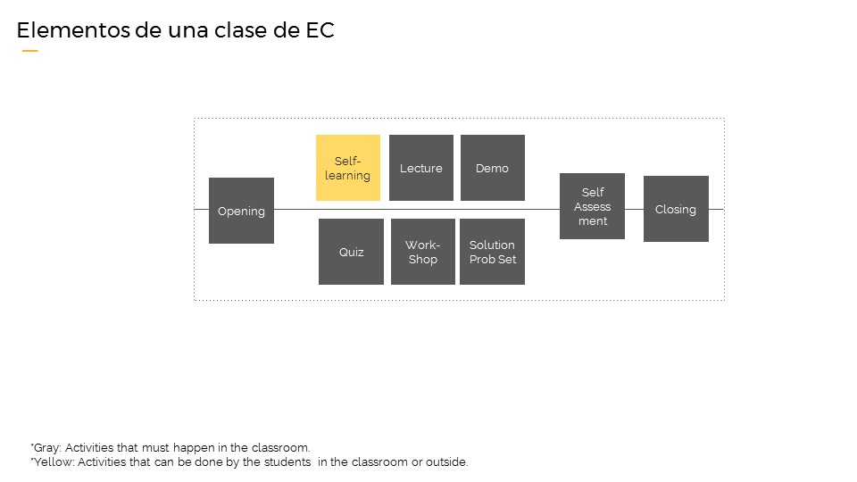

# ¿Qué es Educación Continua?

Educación Continua es el proceso de formación de alrededor de 18 meses, al que acceden nuestras alumnas una vez terminado el bootcamp. En esta etapa las coders tiene la posibilidad de seguir profundizando algunos temas vistos previamente y/o aprender nuevas temáticas que le permitirán seguir creciendo como desarrolladoras.

### Bootcamp

<iframe src="https://drive.google.com/file/d/0B5h-Hkt5a7gSdE10YnZPQTI1Umc/preview" width="560" height="315"></iframe>

### Perfil de nuestras alumnas

La palabra que mejor puede describir al grupo de estudiantes que se gradúan en Laboratoria en el primer período de 2017 es diversidad. Sus vidas y experiencias académicas, familiares y laborales antes de llegar a nuestro salón de clases difieren en gran medida. 

El mayor nivel educativo alcanzado por nuestras estudiantes es un claro ejemplo. Alrededor del 19% de nuestras estudiantes alcanzaron un nivel educativo de Secundaria completa o menor. Casi un 50% de las mujeres que admitimos en nuestro programa han tenido la oportunidad de cursar estudios universitarios, sin embargo, solo un 20% de ellas los han completado. 

Hablando un poco acerca de sus situaciones laborales, 35% de nuestras estudiantes se encontraban activas laboralmente antes de empezar el Bootcamp, mientras que únicamente el 7% de ellas nunca habían tenido alguna experiencia laboral. 

Alrededor del 58% de nuestras estudiantes son madres y tienen un promedio de edad de 27 años. Las egresadas de Laboratoria se encuentran en un rango de edad entre los 18 y 39 años.  

Únicamente el 7% de nuestras estudiantes tenía acceso a internet en su hogar, y sólo el 3% de ellas tenía una computadora a su disposición. En promedio, nuestras egresadas viven en hogares compuestos por 3 personas y alrededor del 20% de ellas viven solas.

### Producto & Operaciones

Como ya viste en la presentación del módulo anterior, en Laboratoria trabajamos en dos equipos separados pero que son muy complementarios: Productos y Operaciones. 

Es de suma importancia que el ciclo de un curso se cierre; esto quiere decir que parte con una demanda real, se crea, se ejecuta y se da feedback para una futura versión. La retroalimentación que nos des clase a clase va a ser fundamental para la calidad del producto.

### Temáticas de los cursos

Nuestro core es continuar con la capacitación de la línea Full Stack JavaScript y a la vez ofrecer cursos que sean de interés en el mundo digital y de tecnología. Algunos de los cursos que ya están definidos van en la siguiente línea:

#### Full Stack JavaScript
   JS Deep Dive, Paradigmas de Programación, Functional JS, React, Redux, The Web Stack, Angular	

#### Digital/Tecnología 
   UXD 1, UXD 2, UX Research, UX Prototyping, UX Ideation, Visualización de datos, SEO, Marketing Digital
              
#### English 4 Developers (E4D)
   Rookie 1, Rookie 2,Rookie 3, Electivos

Estamos  abiertos a cualquier propuesta o idea de cursos, siempre en la línea de entregar skills en la nueva era digital.

La developer puede tomar los cursos del área que quiera, siempre y cuando cumpla con dos requisitos:

1) En el mismo mes no puede tomar más de un curso de tecnologa. Sí pueden tomar uno de la línea Full Stack más uno de E4D, pero no uno de UX y otro de JS.

2) Cumplir los pre-requisitos de ese curso en particular.

Hemos creado una landing de inscripción, en la cual están las ofertas de los cursos por mes por sede. A través de ella nuestras developers pueden inscribirse en los cursos de su interés. Te invitamos a ver la <a href="http://educacioncontinua.laboratoria.la/bienvenidaec" target="_blank">Landing</a>. 

### ¿Cómo son los cursos de educación continua en Laboratoria?

En Laboratoria hemos creado una metodología para los cursos, para que nuestras alumnas aprendan de manera rápida y eficiente todo lo que queremos enseñarle en un mes. 

La modalidad de estos cursos la hemos llamado "4x4". Esto significa que los cursos duran cuatro semanas y cuatro horas aproximadamente cada semana. Tres de estas horas serán presenciales y la hora restante se puede realizar desde donde la alumna quiera. 

Por lo tanto, los cursos de tecnología están creados para durar 1 mes: 3 horas presenciales + 1-2 horas on-line a la semana.
Los 6 primeros meses de E4D tendrán una modalidad diferente. Tienen una duración de 2 meses y contemplan 6 horas a la semana presenciales más 1-2 on-line. Estos cursos de dos meses son los denominados Rookie. 

En todos nuestros cursos las alumnas pueden desarrollar un producto concreto que les permitirá mostrar el resultado de su aprendizaje a quien ellas quieran.

Actualmente el programa de Educación Continua se está desarrollando en 3 de nuestras 5 sedes: 
- Lima 
- Santiago de Chile
- Ciudad de México

### Estructura de una clase

[SIGUIENTE](02-perfilprofesor.md)

